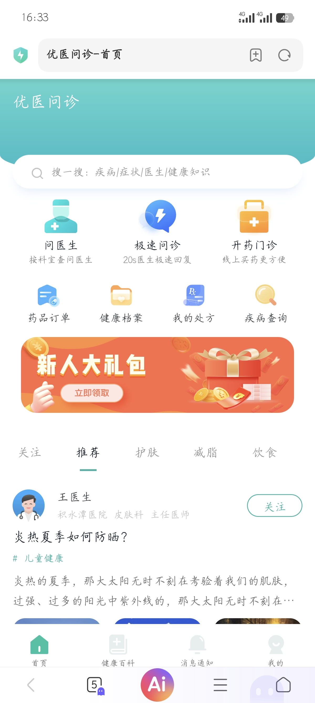
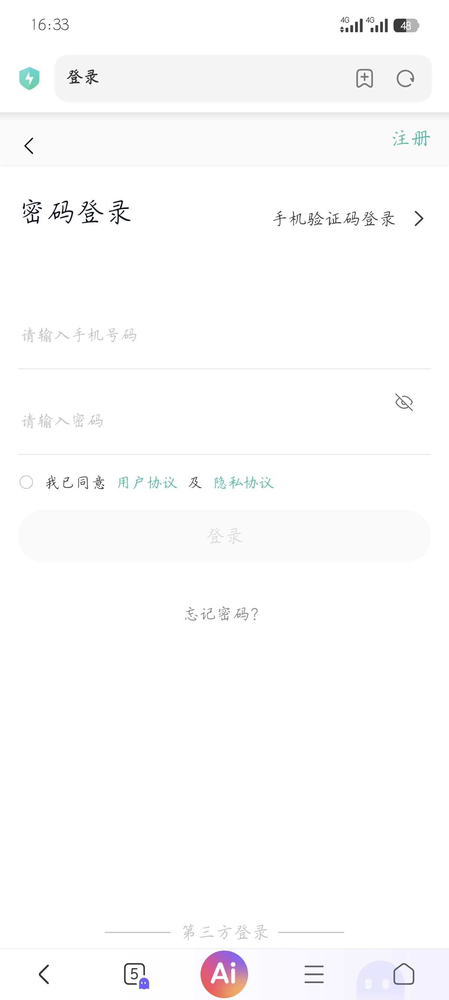

# 优医问诊 - 移动端医疗H5项目

## 项目简介

优医问诊是一个移动端医疗健康咨询平台的前端页面，包含首页、登录页，采用vw/rem适配方案，兼容不同尺寸的手机屏幕。

本项目是个人前端学习练手项目，通过完整复刻一个真实移动端H5项目，巩固HTML5、CSS3、Flex布局、移动端适配等前端基础知识。

## 技术栈

- **HTML5**：语义化标签、表单、多媒体
- **CSS3**：Flex布局、定位（relative/absolute/fixed/sticky）、渐变、阴影、圆角、过渡
- **CSS变量**：使用:root统一管理颜色变量
- **移动端适配**：vw单位适配 + rem单位+flexible.js适配（两套方案）
- **伪元素**：::before/::after实现渐变背景、分割线等效果
- **字体图标**：iconfont字体图标
- **响应式布局**：sticky吸顶、fixed固定导航

### 首页
- 渐变头部 + 弧形底部设计
- 搜索框（带阴影效果）
- 两行功能入口导航（3个主要功能 + 4个次要功能）
- Banner广告位
- Tabs切换栏（sticky吸顶效果）
- 文章内容列表（医生头像、标题、标签、内容、配图、收藏评论数）
- 底部固定导航栏

### 登录页
- 顶部固定导航栏（返回 + 注册）
- 登录方式切换（密码登录 / 手机验证码登录）
- 手机号、密码输入框（密码可见性切换）
- 用户协议勾选
- 登录按钮
- 忘记密码
- 第三方登录（QQ登录，带分割线效果）

## 项目截图

## 怎么运行

1. 下载或克隆项目到本地
2. 直接用浏览器打开 `index.html` 即可查看首页
3. 点击首页"问医生"可跳转到登录页
4. 建议用Chrome开发者工具的手机模式查看，效果最佳

## 项目结构

优医问诊项目 /
├── index.html          # 首页（vw 适配版）
├── index-vmin.html     # 首页（vmin 适配版）
├── login.html          # 登录页（rem 适配版）
├── README.md           # 项目说明文档
├── favicon.ico         # 网站图标
├── CSS/
│   ├── base.css        # 基础重置样式
│   ├── index.css       # 首页样式
│   ├── index-vmin.css  # vmin 版首页样式
│   └── login.css       # 登录页样式
├── js/
│   └── flexible.js     # rem 适配脚本
├── iconfont/           # 字体图标文件
└── img/                # 图片素材（SVG 图标 + JPG 配图）

## 学习收获

通过这个项目，我巩固了以下前端知识：

1. **移动端适配**：掌握了vw、rem、vmin三种移动端适配方案，理解了各自的优缺点和适用场景
2. **Flex布局**：熟练运用Flex实现各种导航、列表、卡片布局
3. **定位**：掌握了relative、absolute、fixed、sticky四种定位的使用场景
4. **CSS变量**：学会用CSS变量统一管理颜色，提高代码可维护性
5. **伪元素**：熟练使用::before/::after实现渐变背景、分割线等装饰效果
6. **项目规范**：理解了企业级项目的目录结构和代码组织方式
7. **细节处理**：多行文本省略号、sticky吸顶、fixed固定导航、图片圆角等细节处理

## 后续计划

- [ ] 学习JavaScript，为页面添加交互功能（tabs切换、表单验证、登录逻辑等）
- [ ] 学习Vue/React框架，用框架重构这个项目
- [ ] 对接后端API，实现真实的数据交互
- [ ] 添加更多页面（医生列表、医生详情、问诊页面等）

---

**个人学习项目，仅供学习交流使用。**
